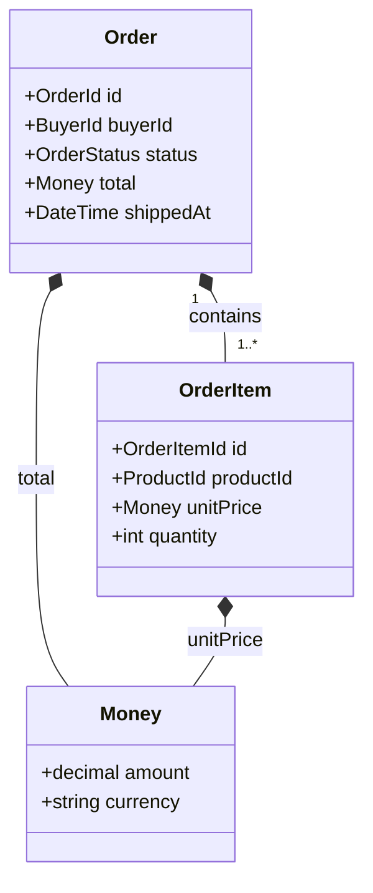
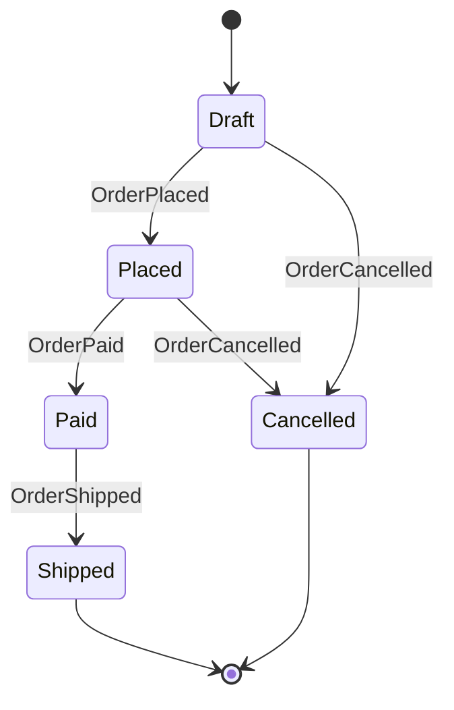
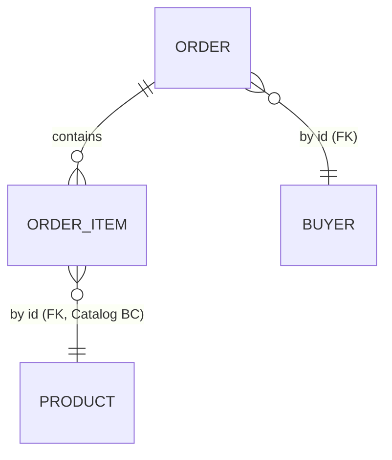

# Domain Model — 出力フォーマット詳細

SKILL.md の Phase 5 から参照される、ドメインモデルの最終出力フォーマット詳細。**最終出力を生成する直前に必ずこのファイルを読む**こと。

## 目次

1. [フォーマット適用度の段階的厳格さ](#フォーマット適用度の段階的厳格さ)
2. [出力テンプレート（コアドメイン用フル形式）](#出力テンプレートコアドメイン用フル形式)
3. [サブドメイン別の最小構成](#サブドメイン別の最小構成)
4. [フォーマット細部ルール](#フォーマット細部ルール)
5. [自己評価チェックリスト](#自己評価チェックリスト)

---

## フォーマット適用度の段階的厳格さ

DDD 主流見解（Vernon, Evans, ddd-crew）は「**コアドメインに DDD を集中、汎用ドメインは CRUD で十分**」。Phase 3.2 で分類した3区分ごとに出力厳格さを段階適用する：

| 分類 | 必須セクション | 省略可セクション | 趣旨 |
|------|--------------|----------------|------|
| **コアドメイン** | Description / Structure / Properties / Domain Events / Invariants / Corrective Policies / State Transitions の **全7セクション省略禁止** | なし | 競争優位の源泉。最大限の情報密度で表現する |
| **サポートドメイン** | Description / Properties / Domain Events / Invariants（最低限） | Structure（小規模なら省略可）/ Corrective Policies / State Transitions（CRUD なら省略可、持つ場合「なし」と明示） | コアを支える。イベント記述はするが過剰装飾は避ける |
| **汎用ドメイン** | Description / Properties / Domain Events | Structure / Invariants / Corrective Policies / State Transitions（**全て省略可**） | 認証・通知等。CRUD で十分。**戦術設計を強制しない** |

「省略可」は **必要があれば書いてもよい**意味。汎用ドメインを無理にリッチドメインモデル化しないこと。

### 設計レベルとしての Domain Events

このスキルは **設計フェーズ** の成果物を作る。method signature（`place()` のような実装名）には踏み込まず、**ドメインイベント（業務上起こる事実）** で振る舞いを記述する。これは Phase 2 の Event Storming アプローチと整合する。

- ❌ `place()` / `cancel(reason)` （実装の method signature）
- ✅ `OrderPlaced` / `OrderCancelled` （ドメインイベント = 業務上の事実）
- ✅ Trigger 列で「注文確定」のような **intent（意図）** を business 語彙で記す

---

## 出力テンプレート（コアドメイン用フル形式）

````markdown
# ドメインモデル: [システム名]

## 概要
- 目的: [Phase 1 で特定した目的]
- アクター: [アクター一覧]
- Bounded Context 数: [N]

## Context Map

[Context 間の戦略的関係（Customer-Supplier, Conformist, Anti-Corruption Layer 等）を記述]

## ユビキタス言語辞書

[全 Bounded Context の用語定義。同じ用語が Context によって異なる意味を持つ場合は明示]

---

## Bounded Context: [Context名]
- 分類: コアドメイン / サポートドメイン / 汎用ドメイン
- 責務: [このContextが担う責務]

### [Aggregate名] (Aggregate Root)

**Description**: [一文でこの Aggregate の責務を述べる]

#### Structure



#### Properties

| Property | Type | Required | Description |
|----------|------|----------|-------------|
| id | OrderId (UUID) | yes | 作成時に採番、不変 |
| buyerId | BuyerId (UUID) | yes | Buyer Aggregate への FK 参照 |
| status | OrderStatus | yes | Draft/Placed/Paid/Shipped/Cancelled |
| items | List<OrderItem> | yes | 内部 Entity。注文確定時は1件以上必須（I-3） |
| total | Money | yes | items から導出（I-1） |
| shippedAt | DateTime | no | status=Shipped 時に設定（I-2） |

#### Domain Events

| Event | Trigger (intent) | Preconditions | Effect |
|-------|------------------|---------------|--------|
| OrderPlaced | 顧客が注文を確定 | status=Draft, items≥1, shippingAddr 設定済 | status: Draft → Placed; placedAt 記録 |
| OrderPaid | 決済完了 | status=Placed | status: Placed → Paid |
| OrderShipped | 出荷完了 | status=Paid | status: Paid → Shipped; shippedAt 記録 |
| OrderCancelled | 顧客またはシステムによるキャンセル | status ∈ {Draft, Placed} | status → Cancelled |

#### Invariants

- **I-1** total = sum(items[i].subtotal)
- **I-2** status=Shipped ⇒ shippedAt 設定済 かつ placedAt < shippedAt
- **I-3** OrderPlaced 発火には items≥1 が必須
- **I-4** Cancelled 後は遷移不可

#### Corrective Policies

- **CP-1** 在庫チェック失敗時 → OrderHeldForBackorder 発行（即時ロールバックしない）

#### State Transitions



---

#### [内部Entity名] (Entity, internal to [Aggregate名])

##### Properties

| Property | Type | Required | Description |
|----------|------|----------|-------------|
| id | OrderItemId | yes | Order 内ローカル識別 |
| productId | ProductId | yes | Catalog Aggregate への FK |
| unitPrice | Money | yes | 追加時のスナップショット |
| quantity | int | yes | > 0 |

##### Domain Events

(Root（Order）から駆動される。独自のドメインイベントなし)

##### Invariants

- **OI-1** quantity > 0

##### Corrective Policies

- なし

##### State Transitions

- なし（[Aggregate名] に従属）

---

### Value Objects ([Aggregate名] scope)

#### [VO名]

| Property | Type | Required | Description |
|----------|------|----------|-------------|
| amount | decimal | yes | 非負, precision=2 |
| currency | string | yes | ISO 4217 |

Equality: structural. Immutable. （VO の操作: 加算・乗算など、必要に応じて自然言語で補足）

---

## Cross-Aggregate Reference Map


````

---

## サブドメイン別の最小構成

### サポートドメイン用

````markdown
### [Aggregate名] (Aggregate Root)

**Description**: [一文責務]

#### Properties
[4列固定の表]

#### Domain Events
[4列固定の表。CRUD 中心の Aggregate でも Created/Updated/Deleted 等の最低限のイベントを記す]

#### Invariants
- **I-1** [必要な不変条件のみ]

(Structure / Corrective Policies / State Transitions は必要に応じて。State を持たない場合は省略してもよいが、書く場合は「なし」と明示)
````

### 汎用ドメイン用（最小）

````markdown
### [Aggregate名] (Aggregate Root)

**Description**: [一文責務。CRUD で十分なため最小限]

#### Properties
[4列固定の表]

#### Domain Events
[4列固定の表。Created / Updated / Deleted 等の基本イベントのみで OK]

(Invariants 以下は必要があれば書く程度。汎用ドメインに DDD 戦術設計を強制しない)
````

---

## フォーマット細部ルール

### Properties 表
- ヘッダーは **`Property / Type / Required / Description` の4列固定**
- **Property**（属性名）を先頭列に置く理由: 読み手は名前で走査するため（OpenAPI/JSON Schema 慣習）
- **Type** はプリミティブで OK。ドメイン型がある場合は VO 名を書き、補足が必要なら括弧でプリミティブを併記:
  - `Money (decimal+Currency)` / `OrderId (UUID)` / `Email (string)`
  - 内部 Entity 参照: `List<OrderItem>` / `OrderItem`
  - 他 Aggregate 参照: ID 型（`BuyerId`）で書き、Description に "FK to [Aggregate名]" と明記
- **Required** は `yes` / `no` の **2値固定**。条件付き必須（例: status=Shipped 時のみ必須）は `no` にして Description に「[条件] 時に設定（I-N参照）」と書く
- **Description** は1〜2行。複雑な制約は不変条件 ID（I-N）で参照

### Domain Events 表
- ヘッダーは **4 列**で、列名は `Event`, `Trigger (intent)`, `Preconditions`, `Effect`
- **Event** は過去形・固有名詞の業務イベント（`OrderPlaced`, `LeaveRequested`, `PunchedIn`）
- **Trigger (intent)** は **業務語彙の意図** を1フレーズで記す（`顧客が注文を確定` / `スタイリストがキャンセル` 等）。method signature や parens は使わない
- **Preconditions** は発火可能な状態条件（`status=Draft, items≥1`）。複雑な条件は Invariants に切り出して I-N で参照
- **Effect** は状態遷移と副作用を domain 用語で記す（`status: Draft → Placed; placedAt 記録`）
- 属性表とは **必ず別セクション** にする（属性=「形」、イベント=「事実」）
- 内部 Entity が独自イベントを発火しない場合は「(Root から駆動される。独自のドメインイベントなし)」と明示

**避けるべき記述（実装レベル）**:
- ❌ `place()` のような method signature
- ❌ `Inputs: CancellationReason` のような parameter type
- ❌ `Postconditions: emit X event` のような command-style 表現

**推奨記述（設計レベル）**:
- ✅ Event 名は `OrderPlaced` のような業務イベント
- ✅ Trigger 列は `顧客が注文を確定` のような自然言語の intent
- ✅ Effect 列は `status: Draft → Placed` のような domain 状態遷移

### Invariants
- **`I-1, I-2 ...`** で安定 ID を付与（Aggregate ローカル）
- 内部 Entity 固有の不変条件は `OI-1` のような Entity 固有 prefix
- 単一属性に閉じる場合も Description で「I-N 参照」とリンクし、本体はこのセクションに集約

### Corrective Policies
- **`CP-1, CP-2 ...`** で採番
- 即時整合で守らず結果整合で扱う制約。コア・サポートドメインで該当なしの場合は「なし」と明示
- 汎用ドメインでは省略可

### State Transitions
- Mermaid `stateDiagram-v2` で記述
- **遷移ラベルにはドメインイベント名を使う**（`Draft --> Placed: OrderPlaced` のように、method 名でなく event 名）
- コア・サポートドメインで状態遷移を持たない Aggregate / Entity は「なし」と明示
- 汎用ドメインでは省略可

### Structure（Aggregate 俯瞰図）
- Aggregate Root の直下、Description の直後に **Mermaid `classDiagram`** を配置
- 目的: 「この Aggregate が何で構成されているか」を1図で把握させる。Properties 表が詳細（Required/Description）担当、Structure が構造把握担当の役割分担
- 含めるもの:
  - Aggregate Root（class）と主要な内部 Entity（class）
  - 主要な Value Object（class）— amount/currency 等の attribute も書く
  - 関係: 所有は `*--`（composition）、共有 VO は `o--`（aggregation）、cardinality は `"1" *-- "1..*"` のように明示
- 含めないもの:
  - 他 Aggregate（ER 図に集約）
  - プリミティブ単独属性（ノイズになる）
- 汎用ドメインでは省略可。サポートドメインで Aggregate がシンプル（フィールド数少）なら省略してよい

### Aggregate Root vs 内部 Entity vs Value Object
- **Aggregate Root**: トップレベル `### [名前] (Aggregate Root)` とする。外部からの唯一の入り口
- **内部 Entity**: `#### [名前] (Entity, internal to [Aggregate名])` でサブセクション化
- **Value Object**: Aggregate スコープごとに末尾に `### Value Objects ([Aggregate名] scope)` でまとめる

### Cross-Aggregate Reference Map
- 全 Aggregate を1つの Mermaid `erDiagram` に統合
- Aggregate 間の関係は **必ず ID 参照（FK）** として表現（直接オブジェクト参照禁止 - Vernon ルール3）
- Aggregate が **2 つ以上の場合のみ** 出力する。1 Aggregate のみの小規模ドメインでは省略可

---

## 自己評価チェックリスト

最終出力前に以下を順に確認する。

### 戦略設計（全分類共通）
- [ ] 各 Aggregate は小さく保たれているか（Vernon ルール2）
- [ ] Aggregate 間は ID 参照のみか（Vernon ルール3）
- [ ] Context 境界は言語ゲームの境界と一致しているか
- [ ] ユビキタス言語が定義されているか
- [ ] Bounded Context ごとにコア/サポート/汎用の分類が付与されているか

### コアドメイン Aggregate
- [ ] Description / Structure / Properties / Domain Events / Invariants / Corrective Policies / State Transitions の **全7セクション** が出力されているか（該当なしは「なし」と明示）
- [ ] Mermaid `classDiagram`（Structure 俯瞰図）が Root + 主要 Entity + 主要 VO + 関係（composition/aggregation）を含んでいるか
- [ ] 不変条件に安定 ID（I-N）が付与されているか
- [ ] **Domain Events 表が method signature ではなく業務イベント（過去形固有名詞）で書かれているか**
- [ ] 貧血モデルになっていないか（Domain Events 表が空でなく、Root に主要イベントがある）

### サポートドメイン Aggregate
- [ ] Description / Properties / Domain Events / Invariants の **4セクション最低限** が出力されているか
- [ ] State Transitions が必要なら Mermaid `stateDiagram-v2` で書かれているか、不要なら「なし」明示か
- [ ] 過剰装飾していないか（コアと同じ厳格さは不要）

### 汎用ドメイン Aggregate
- [ ] Description / Properties / Domain Events の **3セクションのみ** で十分簡素になっているか
- [ ] Structure / Invariants / Corrective Policies / State Transitions を **無理に書いていないか**（汎用に DDD 戦術設計は強制しない）

### フォーマット規約
- [ ] Properties 表のヘッダーは 4 列で `Property / Type / Required / Description` か
- [ ] Required 列は yes/no の2値のみか（Conditional 等の中間値が混入していないか）
- [ ] Properties 表の Type 列は規約どおりか（VO 名 / プリミティブ / ID 型 / List<Entity> の使い分け）
- [ ] Domain Events 表のヘッダーは 4 列で `Event / Trigger (intent) / Preconditions / Effect` か
- [ ] Domain Events 表に method signature（`place()` 等）が混入していないか
- [ ] State Transitions の遷移ラベルがドメインイベント名（`OrderPlaced`）で記述されているか
- [ ] 属性表にイベントが混じっていないか（別セクションに分離）

### 全体構造
- [ ] Aggregate が 2 つ以上の場合、Cross-Aggregate Reference Map が Mermaid `erDiagram` で出力されているか
- [ ] Value Objects セクションが Aggregate スコープごとに末尾でまとめられているか
